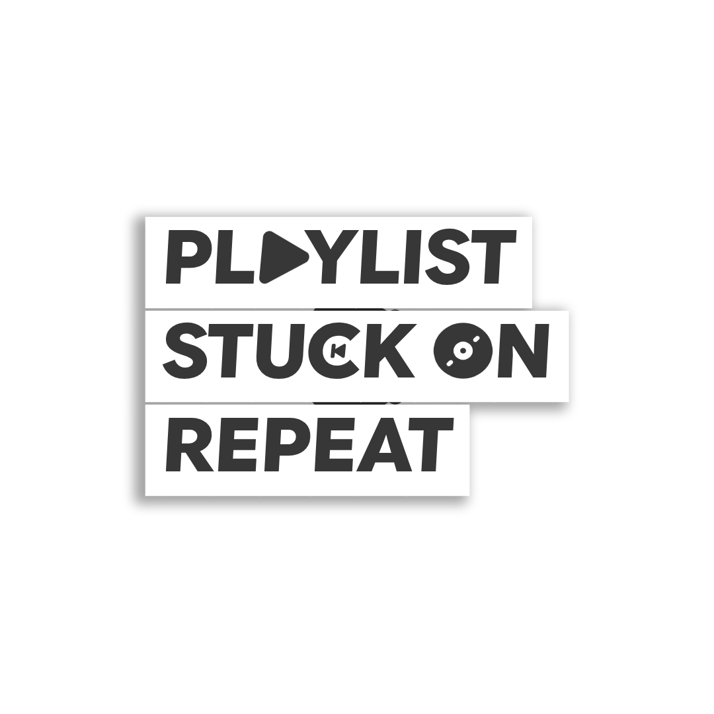

  

<h1 align="center">Playlist Stuck on Repeat</h1>

  A premium, high-performance Taiko-style rhythm game built from the ground up for ultimate response times, smooth visual transitions, and endless replayability.

---

## What is Playlist Stuck on Repeat?

Have you ever had that one song, or that one group of songs, that you just could not stop playing? You listen to it on your commute, while you work, when you relax, and when you wake up. Your playlist is, quite literally, stuck on repeat. 

This game is a tribute to that obsessive relationship we have with music and rhythm. It is a game where you play your favorite songs on repeat, mastering every beat, every drum roll, and every complex pattern until they become second nature.

## Core Game Mechanics

Playlist Stuck on Repeat is designed to feel incredibly snappy, responsive, and satisfying:

* **Taiko Style Gameplay:** Hit the inner and outer drums to the rhythm of incoming beats. Red circles represent center hits, and blue circles represent rim hits. Larger circles require simultaneous double-key inputs.
* **Osu Beatmap Integration:** Easily import your favorite `.osz` files via drag and drop! The game parses the song files and loads every difficulty dynamically into your playlist.
* **Hold to Exit:** No more accidental quits. Just like in professional rhythm game client suites, you need to hold the Escape key for a full second to exit to prevent mid-game interruptions.
* **Rebindable Controls:** Fully customize your inputs inside the custom Settings menu to match your preferred playstyle.
* **Dynamic Performance Pipeline:** The game utilizes a hybrid engine-level sync pipeline. Enjoy smooth VSync frames during menu navigation and intros, then automatically transition to an ultra high polling rate frame engine during gameplay for minimum input latency.

## Game Showcase

See the premium interface, fluid visual design, and real-time gameplay trackers in action:

  

  

## Powered by ArtFrameEXT

Under the hood, Playlist Stuck on Repeat is powered by the **ArtFrameEXT** game framework. 

ArtFrameEXT is a modern, lightweight, open-source C# game engine built on top of:
* **FNA:** For robust, cross-platform XNA-compatible 2D and 3D graphics rendering.
* **SDL3:** For raw low-latency windowing, hardware handling, and peripheral input management.
* **BASS Audio Library:** For high-fidelity audio decoding, playback control, and real-time effects like the underwater low-pass filter transition.

## Licensing

This project is licensed under the MIT License. Feel free to copy, modify, and distribute the game under the terms described in the [LICENSE.txt](LICENSE.txt) file.
